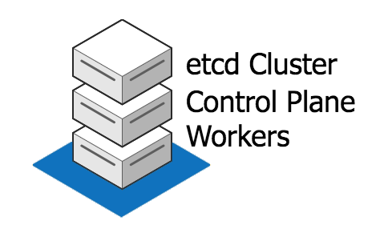
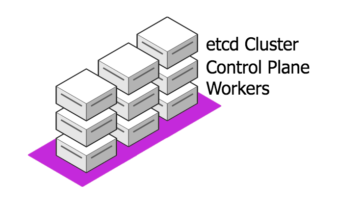
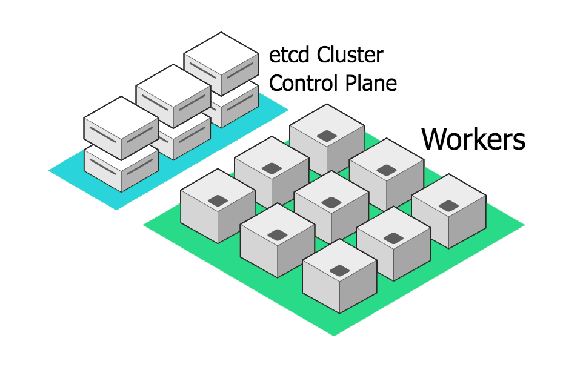
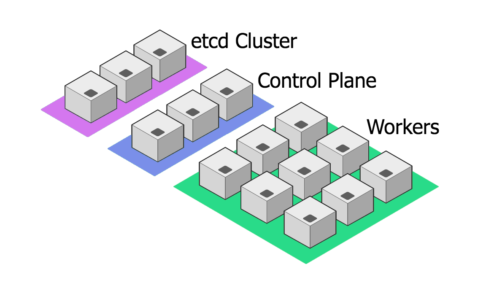

k8s BOSH Release
================

This is a BOSH release for spinning Kubernetes 1.12.0, using BOSH
to orchestrate the "physical" nodes that comprise the various
roles of a Kubernetes cluster (master and worker).

Rationale
---------

This is, at present, an investigative project, wherein I am
attempting to learn how to assemble a working, highly-available
Kubernetes cluster from first principles.

I am following Kelsey Hightower's [Kubernetes the Hard Way][kthw]
write-up.

I am aware of other efforts to BOSH-ify Kubernetes, like
[kubo][kubo].  This project does not aim to replace those other
projects in any way, and if you find joy in using those projects,
please continue using them.

Deployments
-----------

This repository comes with some sample manifests to illustrate how
one might configure a k8s deployment in the wild.

  - **tinynetes** - A single-VM instance, all-in-one k8s
    "cluster", suitable for experimentation or CI/CD.

    

  - **labernetes** - A multi-node cluster of combined
    master+worker nodes, suitable for shared lab exercises.

    

  - **prodernetes** - A proper cluster with master and worker
    nodes on separate VMs, allowing one to scale the workers
    separately from the control plane.  All aspects of the control
    plane are co-located (etcd, api, scheduler, and cmgr).
    Suitable for (possibly) some real-world prod use.

    

  - **hugernetes** - A REALLY BIG CLUSTER that splits the etcd
    component out onto its own multi-node cluster, leaving the
    control plane VMs to run api, scheduler, and the controller
    manager.  Suitable for (possibly) some real-world prod use.

    

These are found in the `manifests/` directory, and can be deployed
without further pre-processing (no Spruce... yet).

Contributing
------------

I am not currently accepting unrequested PR's or other
contributions to this repository.  As I said, this is a personal
project, for exploring the world of Kubernetes through the lens of
a BOSH director.

If you find this, and manage to get it to work for you, great!
I'd love to hear from you, of your successes and struggles.

[kthw]: https://github.com/kelseyhightower/kubernetes-the-hard-way
[kubo]: https://github.com/cloudfoundry-incubator/kubo-release
