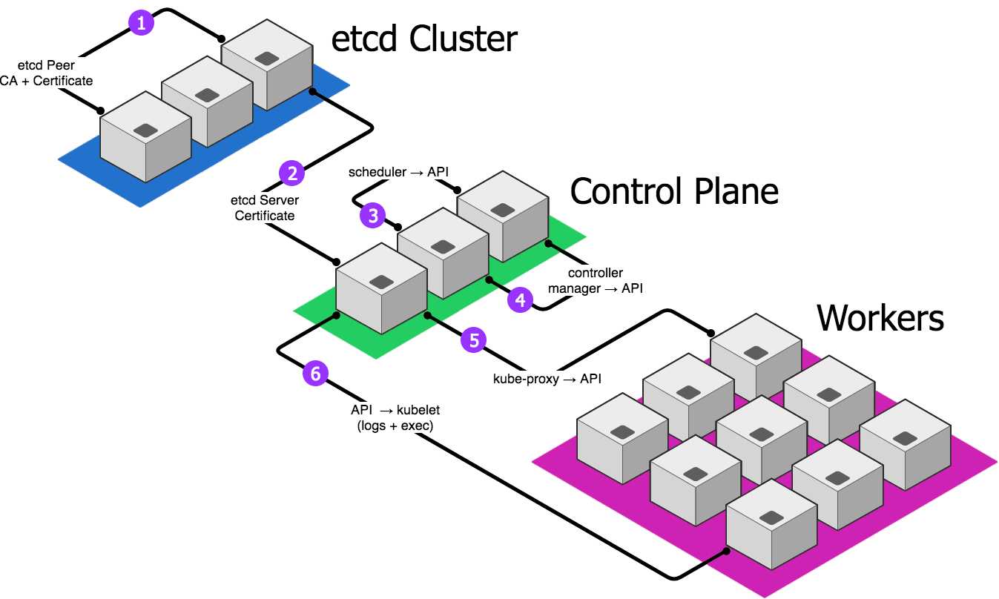

TLS in the k8s BOSH Release
===========================

Transport Layer Security is used everywhere inside of Kubernetes,
and X.509 certificates play an important role in inter-component
authentication.  If we get it wrong, things stop working.

This document lays out the structure and interplay of the k8s
Certificate Authority (CA) and component certificates.  It also
details the specific parameters of each, including:

  - Key strengths
  - Subject requirements like Common Names, and Organizations.
  - Key usage and Extended key usages
  - Subject Alternate Names

Most of this information was gleaned from looking at other
Kubernetes initialization systems, like `kubeadmin`.  Where
possible, links to the official [kubernetes.io][kdocs]
documentation are provided.


X.509 PKI Topology
------------------



Kubernetes uses TLS for the following:

1. etcd cluster members validate each others' identities using the
   **etcd Certificate Authority** and **etcd Peer certificates**.

2. The API server and etcd authenticate mutually; involves the
   **etcd Server certificate** and the **API Server certificate**
   (used here in _client_ mode).

3. The kube-scheduler and API server authenticate mutually;
   involves the **API server certificate** and the **Scheduler
   Component certificate**.

4. The kube-controller-manager and API server authenticate
   mutually; involves the **API Server certificate** and the
   **Controller Manager Component certificate**.

5. The kube-proxy and API server authenticate mutually; involves
   the **API Server certificate** and the **Proxy Component
   certificate**.

6. The API server and the Kubelet authenticate mutually; involves
   the **Kubelet certificate** and the **API &rarr; Kubelet
   certificate**.


The Certificate Authority
-------------------------

At the root of the PKI is a _certificate authority_.  A CA
consists of a private key (the _CA signing key_) and an X.509
certificate allowing the key to be used to sign other
certificates.

The CA certificate can be (and often is!) self-signed; that is the
signing key component is used to digitally sign (and self-verify)
the certificate component.  Kubernetes treats the CA certificate
as explicitly trusted, so operators do not have to muck about with
system trusted roots.

The CA certificate requires the following key usage extensions:

  - `digitalSignature` - The CA public key can be used to verify
    signatures made by the CA signing key.  This is the basic
    property that most people think of when dealing with PKI and
    X.509 web of trust.

  - `keyEncipherment` - The CA public key can be used to
    _encipher_ (encrypt) private and secret keys for transport.

  - `serverAuth` - The CA certificate can be used to prove the
    identity of a component acting as a server.

  - `clientAuth` - The CA certificate can be used to prove the
    identity of a component acting as a client.

These are defined more normatively in [RFC 5280][rfc5280],
sections 4.2.1.3 and 4.2.1.12.

To generate the Certificate Authority in `safe`:

```
$ safe x509 issue --ca \
    --ttl 10y \
    --subject /cn=kubernetes-ca/o=kubernetes
    --key-usage digital_signature \
    --key-usage key_encipherment \
    --key-usage server_auth \
    --key-usage client_auth \
    --name kubernetes \
    secret/path/to/your/ca
```


Administrative Client Certificate
---------------------------------

[Authentication and Authorization][rbac] (collectively called
"RBAC") is configured _inside_ of Kubernetes once it is up and
running.  However, you have to have a place to start from, in
order to reconfigure RBAC parameters.

The Administrative Client Certificate is implicitly trusted as a
`cluster-admin` (i.e. a super user) account.  The certificate
subject's organization (`O`) component of `system:masters` is
responsible for this little bit of magic.

```
Subject:  /cn=admin/o=system:masters
Key Type: RSA
Strength: 2048- or 4096-bit
SANs:     (none)
```

To generate this certficate in `safe`:

```
$ safe x509 issue \
    --signed-by secret/path/to/your/ca \
    --ttl 10y \
    --subject /cn=admin/o=system:masters \
    --name admin
    secret/path/to/your/admin/cert
```


Automaton Client Certificate
----------------------------

Like the _Administrative Client Certificate_, the Automaton Client
Certificate is used to identy an administrative user to the
Kubernetes API server.  The intended usage is slightly different
however; this certificate will be used by the k8s BOSH release
itself, for automation and bootstrapping.

To all outward appearances, it looks just like an admin client
certificate, with a different CN (`automaton` instead of `admin`)..

```
Subject:  /cn=automaton/o=system:masters
Key Type: RSA
Strength: 2048- or 4096-bit
SANs:     (none)
```


`etcd` Server Certificate(s)
----------------------------

Kubernetes uses etcd as a distributed, clustered, key-value store.
Since all of the persistent data in Kubernetes goes into etcd, we
want to make sure that (a) all communications with etcd are
encrypted, and (b) we can verify that the etcd nodes we
communicate with are actual etcd nodes.

To this end, we issue each etcd instance its own certificate, with
the following parameters:

```
Subject:  /cn=system:node:${HOSTNAME}/o=system:nodes
Key Type: RSA
Strength: 2048-bit
SANs:
  - kubernetes
  - kubernetes.default
  - ${INTERNAL_IP}
  - 127.0.0.1
```

Here,`${HOSTNAME}` is the short hostname of the local node
(via `hostname -s`), and `${INTERNAL_IP}` is the cluster-local
private IP address of the etcd node (usually a 10.x.x.x address).

**Note:** this certificate is generated by a BOSH pre-start script
on the `etcd` VM; operators are not responsible for its
configuration.

We add `127.0.0.1` to the list of subject alternate names so that
operators on the BOSH etcd VM can curl locally, and so that the
`status-of-etcd` errand (which is colocated there) can do
likewise.

Since etcd is only ever access directly by the API servers, there
is no need to list any public IP addresses in the SANs; in fact,
etcd should not even _have_ any public network presence.


`etcd` Peer Certificate(s)
--------------------------

When an `etcd` peer attempts to join a cluster, the other members
of the cluster validate the peer's identity and eligibility
through the use of a _peer certificate_, which is signed by a
_peer certificate authority_.  While this CA could be separate
from our Kubernetes CA, it need not be.  Currently, in this BOSH
release, we re-use the Kubernetes CA as the etcd peer CA.

Re-using the CA allows us to also re-use the etcd server
certificates.

Currently, this BOSH release does not provide anything new or
unique for etcd peer certificates.


API Server Certificate(s)
-------------------------

The Kubernetes API server is the central component of the entire
system.  It fields requests from inside (i.e. components like
scheduler), and out (i.e. admin users) to both query and update
the state of the cluster.  The API server certificate needs to be
usable for identity verification for both of these user sets.

```
Subject:  /cn=system:node:${HOSTNAME}/o=system:nodes
Key Type: RSA
Strength: 2048-bit
SANs:
  - kubernetes
  - kubernetes.default
  - ${EXTERNAL_IP}
  - ${INTERNAL_IP}
  - ${HOSTNAME}
  - 127.0.0.1
```

Here,`${HOSTNAME}` is the short hostname of the local node
(via `hostname -s`), `${INTERNAL_IP}` is the cluster-local
private IP address of the API node (usually a 10.x.x.x address),
and `${EXTERNAL_IP}` is the public-facing IP address or
fully-qualified domain of the load balancer in front of the API
server.

**Note:** this certificate is generated by a BOSH pre-start script
on the `control` VM; operators are not responsible for its
configuration.


Kubelet Certificate(s)
----------------------

Each worker node, called a _kubelet_, needs to connect to the API
server to figure out what to do, in terms of executing containers
and spinning up Pods.  To do so, each kubelet needs its own
certificate.

We issue that certificate for each node, with the following
parameters:

```
Subject:  /cn=system:node:${HOSTNAME}/o=system:nodes
Key Type: RSA
Strength: 2048-bit
SANs:
  - 127.0.0.1
  - ${INTERNAL_IP}
  - ${HOSTNAME}
```

Again,`${HOSTNAME}` is the short hostname of the local node
(via `hostname -s`), and `${INTERNAL_IP}` is the cluster-local
private IP address of the kubelet (usually a 10.x.x.x address).

**Note:** this certificate is generated by a BOSH pre-start script
on the `kubelet` VM; operators are not responsible for its
configuration.

The 127.0.0.1 address is included for single-node deployments
where we might target the API server via loopback, presenting a
source address of 127.0.0.1.


API &rarr; Kubelet Certificate(s)
---------------------------------

Most of the time, the Kubernetes API server is passive; it accepts
inbound connections from other parts of the Kubernetes cluster,
like the scheduler.  However, there are cases where the API needs
to communicate to a specific kubelet:

  - Retrieving logs from a Pod (which executes on a single node).
  - Executing arbitrary processes in a Pod.

For that purpose, the API server needs a client certificate to
authenticate to the kubelets:

```
Subject:  /cn=kubelet-client/o=system:masters
Key Type: RSA
Strength: 2048-bit
SANs:
  - 127.0.0.1
  - ${INTERNAL_IP}
  - ${HOSTNAME}
```

As before,`${HOSTNAME}` is the short hostname of the local node
(via `hostname -s`), and `${INTERNAL_IP}` is the cluster-local
private IP address of the API node (usually a 10.x.x.x address).

**Note:** this certificate is generated by a BOSH pre-start script
on the `control` VM; operators are not responsible for its
configuration.

The 127.0.0.1 address is included for single-node deployments
where we might initiate communication with the kubelet via
loopback, presenting a source address of 127.0.0.1.


`kube-proxy` Component Certificate
----------------------------------

Each worker node runs a TCP proxy service (as a _DaemonSet_).
This component watches the API server for changes that might
require port forwarding or proxy reconfiguration, and therefore
needs a client certificate to authenticate with.

Here are the parameters for the proxy client certificate:

```
Subject:  /cn=system:kube-proxy/o=system:node-proxier
Key Type: RSA
Strength: 2048-bit
SANs:
  - system:kube-proxy
```

**Note:** this certificate is generated by a BOSH pre-start script
on the `kubelet` VM; operators are not responsible for its
configuration.


`kube-controller-manager` Component Certificate
-----------------------------------------------

Each control plane node (the `control` VM) runs an instance of the
Kubernetes Controller Manager, which contains all of the brains of
the higher-level abstractions like Deployments, Replica Sets, etc.
The Controller Manager talks to the API server and watches for
changes that evoke the required response behaviors.

For this to work, the controller manager processes needs a client
certificate for authenticating to the API server:

```
Subject:  /cn=system:kube-controller-manager/o=system:kube-controller-manager
Key Type: RSA
Strength: 2048-bit
SANs:
  - system:kube-controller-manager
```

**Note:** this certificate is generated by a BOSH pre-start script
on the `control` VM; operators are not responsible for its
configuration.


`kube-scheduler` Component Certificate
--------------------------------------

Each control plane node (the `control` VM) runs an instance of the
Kubernetes Scheduler, which is responsible for assigning Pods to
nodes for execution.  The Scheduler talks to the API server to do
its job.

For this to work, the scheduler processes needs a client
certificate for authenticating to the API server:

```
Subject:  /cn=system:kube-scheduler/o=system:kube-scheduler
Key Type: RSA
Strength: 2048-bit
SANs:
  - system:kube-scheduler
```

**Note:** this certificate is generated by a BOSH pre-start script
on the `control` VM; operators are not responsible for its
configuration.


Open Questions
--------------

This section lists open questions about the Kubernetes TLS
implementation.

1. Does the CA certificate truly need the `serverAuth` and
   `clientAuth` extended key usage extensions?  If so, why?

2. Is there any increase in security posture by using a separate
   etcd CA (perhaps signed by the Kubernetes CA, perhaps not)?

3. Does etcd need anything special in the subject, or does it
   just need SANs for its IP addresses (including loopback)?

4. Do we need to list the IP / hostname of the BOSH VM in the
   kube-proxy certificates, if we are running it as a DaemonSet
   _inside_ of Kubernetes?  Shouldn't `kube-proxy.*` be enough?

   **ANSWER**: no, we do not.  Nor do we have to do it for
   Controller Manager, or Scheduler.  We now just add the SAN for
   the CN (`system:...`) for good measure.


[kdocs]:   https://kubernetes.io/docs/setup/certificates
[rbac]:    https://kubernetes.io/docs/reference/access-authn-authz/rbac
[rfc5280]: https://tools.ietf.org/html/rfc5280
